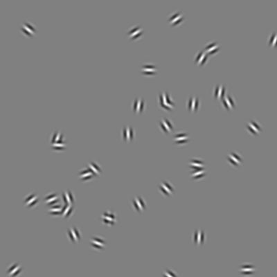
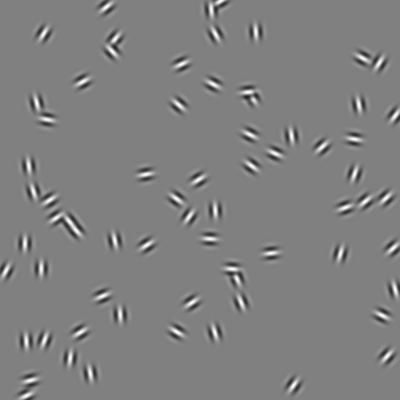
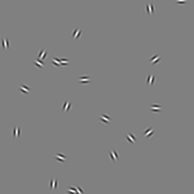
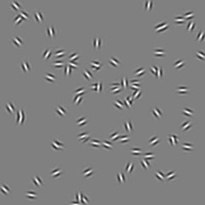
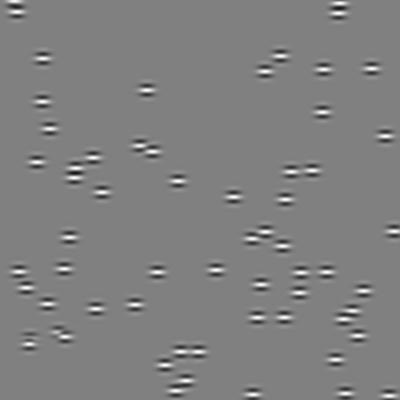
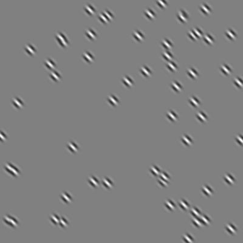
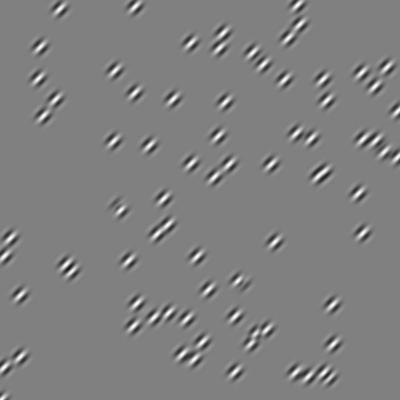
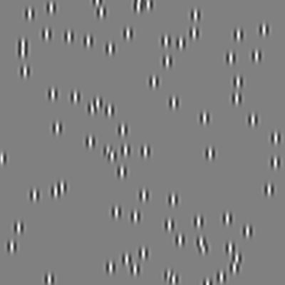

# Neural Networks and Visual Illusions
Final project for neural networks and machine learning

## 1. Introduction

 
 
 
<em> <strong>Figure 1.</strong> Examples of variable stimuli. These were used for training set. </em>

 
 
 
<em> <strong>Figure 2.</strong> Examples of coherent stimuli. These were used for test set. </em>

